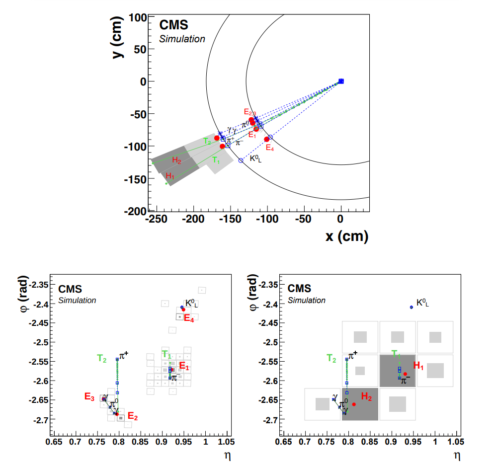

# Core Particle Flow algorithm
**PRELIMINARY (COMMENTS WELCOME)**

##  Overview of the core PF algorithm

After the formation of PF blocks, particle candidates are separated out by the core PF algorithm. The resulting list of “particle flow candidates” becomes the input to any event interpretation algorithm in CMS.

In each PF block the identification and reconstruction sequence proceeds as so:

1. Muon candidates are identified and reconstructed and the corresponding PF elements are removed from the PF block. 
2. Electron identification and reconstruction with the aim of collecting the energy of all bremsstrahlung photons. Energetic and isolated photons, both converted and unconverted, are also identified here. Corresponding tracks and ECAL or preshower clusters are removed from further consideration.
3. The remaining elements in the PF block are then subject to a cross-identification of charged hadrons, neutral hadrons, and photons, arising from parton fragmentation, hadronization, and decays in jets.
4. Nuclear interactions coming from hadrons create secondary particles. These hadrons are identified and reconstructed.
5. When the global event description becomes available, meaning when all blocks have been processed and all particles identified, the reconstructed event is revisited by a post-processing step.

So in conclusion particles are dealt with in this order: muons, electrons, hadrons, photons, nuclear interactions. When one of them is processed, the corresponding tracks-clusters-links are removed from further consideration.

The flowchart below gives an overview of the core PFAlgo, and the code for the core PFAlgo can be found <a href="https://github.com/cms-sw/cmssw/blob/master/RecoParticleFlow/PFProducer/src/PFAlgo.cc" target="_blank" rel="noopener">here</a>.

{ width="800" style="display: block; margin: 0 auto" }

##  Identification and reconstruction of PF candidates
This section is based on <a href="https://iopscience.iop.org/article/10.1088/1748-0221/12/10/P10003/pdf" target="_blank" rel="noopener">"Particle-flow reconstruction and global event description with the CMS detector"</a> by the CMS collaboration released in 2017.

All particles reconstructed by the PF algorithm are called PF candidates. The sections that follow describe the identification and reconstruction of the different types of PF candidates, which are also used to build hadronically decaying taus ($\tau_{h}$), jets, and determine the missing transverse energy (MET), in the order that they are processed by the PF algorithm.

###  Muons
 { align=right }

Since muons are electrically charged particles, they leave tracks in the inner tracking system of CMS. They have little or no interactions with both the ECAL and HCAL, but they do interact with the CMS muon system, consisting of drift tube (DT) chambers, cathode strip chambers (CSC), and resistive plate chambers (RPC). 

The muon system grants a high efficiency for muon identification over the full detector acceptance. A high purity is achieved, due to the ECAL and HCAL absorbing the other particles except neutrinos. The momentum of muons is precisely measured by the inner tracker. 
The final collection of muon physics objects comprises of 3 types:

* Standalone muon
 
Hits within each DT or CSC detector are clustered to form track segments. These track segments are used as seeds for the pattern recognition in the muon system, which aims to gather all DT, CSC, RPC hits along the muon trajectory. The result of the final fitting is called a standalone muon track.
* Global muon
 
Each standalone-muon track is matched to a track in the inner tracker (inner track), if the parameters of the corresponding tracks propagated onto a common surface are compatible. The hits from the two tracks are combined and fit to form a global muon track. 
* Tracker muon
 
Inner tracks with $p_T>0.5$ GeV and total momentum $p>2.5$ GeV are extrapolated to the muon system. If at least 1 track segment matches the extrapolated track, the inner track passes as a tracker muon track. The track to segment matching is done in a local coordinate system $(x,y)$ that is defined in a plane transverse to the beam axis, where $x$ is the better measured coordinate. The track and segment are matched if the absolute value of the difference between their positions in the x coordinate $|\Delta x|<3$ cm or if the ratio of this distance to its uncertainty (pull) is smaller than 4.

The identification of muons in the PF algorithm goes by a set of selections based on the global and tracker muon properties, and is done by the <a href="https://github.com/cms-sw/cmssw/blob/master/RecoParticleFlow/PFProducer/src/PFMuonAlgo.cc" target="_blank" rel="noopener">PFMuonAlgo</a>.

1. Isolated global muons are selected by considering additional inner tracks and calorimeter energy deposits with a distance $\Delta R$ to the muon direction in the $(\eta,\phi)$ plane smaller than 0.3. The sum of the $p_{T}$ of the tracks and of the $E_{T}$ of the deposits is required not to exceed 10% of the muon $p_{T}$. This isolation criteria is enough to reject hadrons that would be misidentified as muons. No further selection is applied to these candidates.
2. More strict identification criteria is needed for muons inside jets. The PF algorithm will tend to create additional fake neutral particles from calorimeter deposits in the case of charged hadrons being misidentified as muons. Unidentified muons will be considered to be charged hadrons, and will absorb the energy deposits of nearby neutral particles. 
For nonisolated global muons, the tight-muon selection is applied. It is required also that at least 3 matching track segments are found in the muon detectors, or that the calorimeter deposits associated with the track are compatible with the muon hypothesis (The calorimetric energy of the clusters is significantly smaller than the sum of the charged track momenta). This selection removes most of the high $p_{T}$ hadrons misidentified as muons, as well as accidental associations of tracker and standalone muon tracks.
3. Muons failing tigh-muon selection because of:

    * Poorly reconstructed inner tracks. For example hit confusion with other nearby tracks. These are salvaged if the standalone muon track fit is of high enough quality and associated with a large number of hits in the detectors (23/32 hits in the DT, 15/24 hits in the CSC).
    * Poor global fit. If a high quality fit is obtained with at least 13 hits in the tracker, the muon is selected, if the associated calorimeter clusters are compatible with the muon hypothesis.

4. The momentum of the muon is chosen to be that of the inner track if its $p_{T} < 200$ GeV. Above this value, the momentum is chosen according to the smallest $\chi^{2}$ probability from the different track fits: tracker only, tracker and first muon detector plane, global, global without the muon detector planes featuring a high occupancy.
5. The PF elements making up these identified muons are masked against further processing in the corresponding PF block, which means they are not used as building elements for other particles. However, at this point muon identification and reconstruction is not complete yet! In the reconstruction of hadrons, charged hadron candidates are checked for compatibility of the measurements of their momenta in the tracker and energies in calorimeters. If the track momenta is significally higher than the calibrated sum of the linked calorimeter clusters, the muon identification criteria is revisited with looser selections on the fit quality and on the hit or segment associations. Basically everything is done with looser selection criteria.

To read more about muon reconstruction, click <a href="https://twiki.cern.ch/twiki/bin/view/CMSPublic/SWGuideMuons" target="_blank" rel="noopener">here</a>.

### Electrons

This section will focus on the reconstruction of electrons and also mention how isolated photons are reconstructed. The section is mostly based on the original 2017 PF <a href="https://iopscience.iop.org/article/10.1088/1748-0221/12/10/P10003/pdf" target="_blank" rel="noopener">paper</a> and the CMS paper "Electron and photon reconstruction and identification with the CMS experiment at the CERN LHC" found <a href="https://iopscience.iop.org/article/10.1088/1748-0221/16/05/P05014/pdf" target="_blank" rel="noopener">here</a>. The reconstruction is based on the information from both the inner tracker and the calorimeters and starts with the energy reconstruction algorithm that forms clusters of crystals in the ECAL. Crystals with recorded energies above a predefined treshold (80 MeV in EB and 300 MeV in EE) are grouped together - this is known as "clustering". Next, a seed cluster is defined, chosen to be the one containing most of the energy deposited in any specific region, with a minimum transverse energy above 1 GeV. To read more about the clustering algorithm used in the PF framework click <a href="https://twiki.cern.ch/twiki/bin/view/CMSPublic/SWGuideParticleFlowClustering" target="_blank" rel="noopener">here</a>.

ECAL clusters within a certain geometric area around the seed cluster are combined into superclusters (SC). The name of this procedure is "superclustering". The multiple ECAL clusters need to be combined into a single SC that captures the energy of the original electron/photon. This is due to electrons and photons having a significant probability of showering when traversing the CMS tracker - by the time the particle reaches the ECAL, the original object may consist of several electrons and/or photons produced from bremsstrahlung and/or pair production.

In order to include radiative losses from bremsstrahlung an algorithm known as the GSF (Gaussian Sum Filter) tracking algorithm is used. The GSF algorithm is too CPU intensive to run on reconstructed hits in the tracker so it is applied on electron tracks instead. The reconstruction of the electron tracks begins with the identification of a hit pattern that may lie on an electron trajectory, this is known as "seeding". The electron track seeds can be either ECAL-driven or tracker-driven. Both approaches are shortly described below:

  * ECAL-driven

    The ECAL driven seeding first selects SCs with transverse energy $E_{T}$ bigger than 4 GeV. The SC is compared in $\phi$ and $z-$coordinate with a collection of track seeds, formed by combining multiple hits in the inner tracker (triplets or doublets). The SCs are extrapolated to the collision vertex, and If the first
    two hits of a tracker seed are matched to the predicted trajectory for a SC under any charge hypothesis, it is selected for seeding a GSF track.

  * Tracker-driven

    The tracker driven seeding has an efficiency of about 50% for electrons from Z decay with $p_T$ of about 3 GeV and drops to less than 5% for $p_T$ bigger than 10GeV.
    The tracker-driven approach iterates over all generic tracks, which are tracks with $p_T$ above 2 GeV that are reconstructed from hits in the tracker through an iterative algorithm known as the Kalman filter (KF). If any of these KF tracks is compatible with an ECAL cluster, its track seed is used to seed a GSF track.
    Since it is computationally expensive to reconstruct all tracks in an event, tracker-driven seeding is performed only in the offline reconstruction and not in HLT.

 {width="600", align=right }

If an ECAL-driven seed shares all but one of its hits with a tracker-driven seed, the resulting track candidate is considered as both ECAL- and tracker-seeded. This is also the case for ECAL-driven seeds, which share all hits with a tracker-driven seed, but in this case the tracker-driven seed is discarded before the track-finding step. The majority of electrons fall into one of these two cases.

The final collection of selected electron seeds is obtained by combining the ECAL-driven and tracker-driven seeds. It is used to initiate the reconstruction of electron tracks. For a given seed, the track parameters evaluated at each successive tracker layer are used by the iterative KF algorithm to build the electron trajectory. Once the track candidates are reconstructed by the KF algorithm, their parameters are estimated at each layer with a GSF fit in which the energy loss is approximated by an admixture of Gaussian distributions - we have obtained GSF tracks.

During the 3 steps above, all tracks that are reconstructed in the event, are tested for compatibility with an electron track hypothesis. If successful, they are also used to seed the GSF tracking step.

A dedicated algorithm is used to find generic tracks that are likely to originate from photons converting into electron-positron pairs.

So far we have the following PF elements:

 * ECAL clusters
    * Superclusters
    * Clusters associated with conversion-flagged tracks
 * Tracks 
    * GSF tracks
    * Generic tracks associated with electrons
    * Conversion-flagged tracks

These PF elements are imported into the PFBlock algorithm, where they are linked together into blocks. The blocks are used by the <a href="https://github.com/cms-sw/cmssw/blob/master/RecoParticleFlow/PFProducer/src/PFEGammaAlgo.cc" target="_blank" rel="noopener">PFEgammaAlgo</a>, where they are resolved into electron and photon objects aka e/γ objects, starting from a GSF track or a SC respectively. An e/γ object must always start from either a SC or a GSF track. At this point no differentiation between electron and photon candidates is made. The final list of linked ECAL clusters for each candidate is promoted to a refined supercluster from where e/γ objects are built based on loose selection requirements. Objects that pass the selection with an associated GSF track are labelled electrons, and the ones without GSF tracks are labelled as photons (isolated), since photons are neutrally charged and don't leave tracks in the tracker.

 This collection is known as the unbiased e/γ collection and is used as a starting point by the vast majority of analyses involving electrons and photons.

Separation of electrons and photons from hadrons is done by applying a tighter selection to the e/γ objects to decide if they're accepted as an electron or an isolated photon. If an e/γ objects passes both the electron and photon selection criteria, then its type will be determined by whether it has a GSF track with a hit in the first layer of the pixel detector or not. If it fails both selection criterias then its basic elements, those being the generic tracks and ECAL clusters, are further considered to form neutral hadrons, charged hadrons or nonisolated photons in the PF framework, meaning they go back into the PF block. 

As usual, all tracks and clusters in the PF block used to reconstruct electrons and photons are removed from further processing. Tracks identified as originating from photon conversion but not used in the reconstruction process are masked as well, as they are usually poorly measured and likely to be misreconstructed tracks. The distinction between electrons and photons in the PF global event description can be different from a selection optimized for a specialized analysis. To combat this, the complete history of the electron and photon reconstruction is tracked and saved, to allow a different event interpretation to be made without running the whole PF algorithm again.

To read more about the principles of electron reconstruction, click <a href="https://twiki.cern.ch/twiki/bin/viewauth/CMS/ElectronRecoPrinciples" target="_blank" rel="noopener">here</a>.

###  Photons
Photons can be divided into two categories:

  * Isolated photons - Reconstruction is done at the same time as electron reconstruction.
  * Non-isolated photons - Reconstruction is done at the same time as hadron reconstruction.

For the reconstruction of isolated photons read the section on [electron](corepf.md#electrons) reconstruction, since it follows mostly the same steps with some minor differences explained in the section.

For the reconstruction of non-isolated photons read the section on [hadron](corepf.md#hadrons) reconstruction. 
### Hadrons

The PF algorithm can identify and reconstruct:

  * Charged hadrons
  * Neutral hadrons

ECAL and HCAL clusters not linked to any track give rise to photons (non-isolated) and neutral hadrons. Clusters separated from the extrapolated position of any charged particle track in the calorimeters hint for a clear signature of neutral particles. Let's look at two scenarios:

  1. Within the tracker acceptance |$\eta$| < 2.5, all these ECAL clusters are turned into photons and HCAL clusters into neutral hadrons. But why do all these clusters in the ECAL get turned into photons? The justification is given by the observation that in hadronic jets, 25% of the jet energy is carried by photons, while neutral hadrons leave only 3% of their energy in the ECAL. This means that the energy deposits making up the ECAL clusters are mainly from photons and the HCAL clusters from neutral hadrons. Do keep in mind that we are dealing with ECAL and HCAL clusters that are not linked to any track.
  2. Beyond the tracker acceptance |$\eta$| > 2.5, charged and neutral hadrons cannot be distinguished and they leave in total 25% of the jet energy in the ECAL, meaning that the ECAL energy priority given to photons is no longer justified! Because of this, ECAL clusters linked to a given HCAL cluster are assumed to arise from the same hadron shower (be it charged or neutral), while ECAL clusters without such a link are classified as photons.

 { width="800", align=right }

The remaining HCAL clusters of the PF block are linked to one or several available tracks and these tracks may be linked to some of the remaining ECAL clusters. 
Since hadrons deposit energy in both the ECAL and the HCAL, both cluster energies need to be recalibrated to get an estimate of the true hadron energy (the ECAL is calibrated for photons and has a different response to hadrons). No attempt is made to calibrate the hadrons leaving energy only in the ECAL, as such clusters are identified as photon or electron clusters by the PF algorithm. The calibrated calorimetric energy is determined from the energy of the HCAL cluster and the total energy of the ECAL clusters, under the single charged-hadron hypothesis. The sum of the track momenta is then compared to the calibrated calorimetric energy in order to determine particle content.

  1. If the calibrated calorimetric energy is in excess of the sum of the track momenta by an amount larger than the expected calorimetric energy resolution for hadrons, the excess may be interpreted as the presence of photons and neutral hadrons. Specifically, if the excess is smaller than the total ECAL energy and larger than 500 MeV, the excess is identified as a photon with an energy corresponding to this excess after recalibration under the photon hypothesis. Otherwise, the recalibrated ECAL energy still gives rise to a photon, and the remaining part of the excess, if larger than 1 GeV, is identified as a neutral hadron. Each track gives rise to a charged hadron, the momentum and energy are taken directly from the corresponding track momentum, under the charged-pion mass hypothesis.

  2. If the calibrated calorimetric energy is compatible with the sum of the track momenta, no neutral particle is identified. The charged-hadron momenta are redefined by a $\chi^{2}$ fit of the measurements in the tracker and the calorimeters, which reduces to a weighted average if only one track is linked to the HCAL cluster. When track parameters are measured with degraded resolutions, meaning at very high energies or at large pseudorapidity, this turns out very important. It guarantees a smooth transition between the low energy regime, dominated by tracker measurements, and the high energy regime, dominated by calorimetric measurements. The energy resolution resulting from this is always better than that of the calorimetric energy measurement, even at highest energies.

  3. When the calibrated calorimetric energy is significantly smaller than the sum of the track momenta (rare cases) by 3 standard deviations, a relaxed search for muons is performed (muons deposit very little energy in the calorimeters). 

###  Example

Depicted in the figure below, are three plots describing an event display of an illustrative jet that is made out of five particles. The upper plot is in the $(x,y)$ view with a transverse perspective of the entire event, while the lower two plots are in the $(\eta,\phi)$ view, presenting an overview of the event on the ECAL surface (lower left) and the HCAL surface (lower right).

The event is interpreted by the PF algorithm as follows:

 { width="600", align=right }

  * Three ECAL clusters $E_{2}$, $E_{3}$, $E_{4}$ are within tracker acceptance, and thus no link with any HCAL cluster is created. The three ECAL clusters are not linked to any charged particle track either, so the three corresponding PF blocks give rise to one photon each: 3 blocks $\rightarrow$ 3 photons. The first 2 photons come from the decay of a generated $\pi^{0}$ (ECAL clusters $E_{2}$ and $E_{3}$) and the third photon comes from the energy ($E_{4}$) deposited in the ECAL by the generated $K^{0}_{L}$, which is therefore misidentified as a photon.
  * The fourth PF block consists of two tracks $T_{1}$ and $T_{2}$, the ECAL cluster $E_{1}$, and two HCAL clusters $H_{1}$ and $H_{2}$. Only the track ($T_{1}$) link closest to the HCAL cluster $H_{1}$ is kept, and similarly only the link of $T_{2}$ to $H_{2}$ is kept. The clusters $H_{1}$ and $E_{1}$ with the track $T_{1}$ give rise to a charged hadron ($\pi^{-}$), the direction of which is that of $T_{1}$. The calibrated calorimetric energy is obtained under the charged hadron hypothesis, from the raw energies of both $E_{1}$ and $H_{1}$, with an estimate of the true hadron energy given by the momentum of the track $T_{1}$. The calibrated energy is found to be compatible with the momentum of $T_{1}$, so no neutral particles are identified and the charged hadron energy is obtained from the weighted average of the track momentum and the calibrated calorimetric energy. The same thing applies to the cluster $H_{2}$ and the track $T_{2}$, which give rise to a second charged hadron ($\pi^{+}$).

## Nuclear interactions in the tracker material
A hadron interaction in the tracker material often leads to the creation of a number of charged and neutral secondary particles originating from a secondary vertex. These particles are reconstructed as charged particles (mostly charged hadrons but also muons and electrons), photons, and neutral hadrons by the PF algorithm like usual (whether the secondary vertex is identified or not). When the nuclear interaction vertex (secondary vertex) is identified, the secondary charged particle tracks are linked together, and the secondary charged particles are replaced in the reconstructed particle list by a single primary charged hadron. Its direction comes from the vectorial sum of the momenta of its constituents, its energy is obtained from the sum of their energies, and its mass is set to the charged pion mass. If there is an unused incoming track included in the secondary vertex, then the direction of the primary charged hadron is taken to be that of the incoming track. Furthermore, if, the momentum of the incoming track is well measured, it is used for estimating the energy of secondary particles that were undetected, meaning that they weren't  reconstructed at all (neither as secondary charged particles nor as neutral particles).

## Event post-processing
It is impossible to identify and reconstruct all particles perfectly. In general, misreconstructed particles, tend to average out and do not have a large impact on the evaluation of global event quantities, such as jets and MET. In rare cases an artificially large missing transverse momentum $p_{T}^{miss}$, is reconstructed in the event. This is most often caused by a misidentified or misreconstructed high $p_T$ muon, and leads the event to be wrongly selected by a large set of new physics searches, therefore it needs to be understood and corrected. 