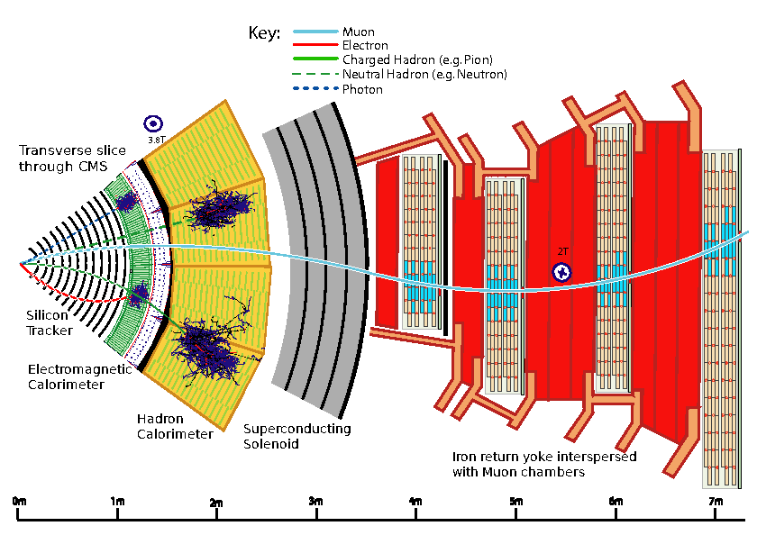

# Overview
**PRELIMINARY (COMMENTS WELCOME)**

Welcome to the documentation of the CMS Particle Flow Algorithm.   
The aim of this page is to provide a centralized overview of the CMS Particle Flow algorithm with the main focus being on:

* [Particle Flow Block algorithm](pfblock.md)
* [Core Particle Flow algorithm](corepf.md)

This page is based on <a href="https://arxiv.org/pdf/1706.04965.pdf" target="_blank" rel="noopener">[1]</a>.

<a href="https://github.com/cms-sw/cmssw/tree/master/RecoParticleFlow/PFProducer/src" target="_blank" rel="noopener">Link</a> to the Particle Flow algorithm in CMSSW.

##  What is Particle Flow?

The Particle Flow (PF) algorithm is used to reconstruct and identify all particles produced in CMS individually by combining information from all subdetectors.
 
These particles include: 

* [Muons](corepf.md#muons)
* [Electrons](corepf.md#electrons)
* [Photons](corepf.md#photons)
* [Neutral hadrons](corepf.md#hadrons)
* [Charged hadrons](corepf.md#hadrons)

##  How do particles traverse through the CMS detector?

Starting from the interaction point, particles will traverse outwards, passing through the following subsystems:

* Inner tracker
* Electromagnetic calorimeter (ECAL)
* Hadronic calorimeter (HCAL)
* Solenoid
* Muon system

The central feature of the  CMS detector is a large superconducting solenoid magnet with a field of currently 3.8 T. Due to the strong magnetic field, the trajectories of charged particles traversing the detector are bent, allowing for a precise momentum and charge measurement by reconstructing their path using the inner tracking detectors. Neutral particles however are identified and measured by their energy deposits in the two calorimeters. Both the inner tracking system as well as the two calorimeters are physically located inside the solenoid, with the muons systems placed in and around an iron return yoke constraining the magnetic field outside the solendoid. A transverse slice of the CMS detector can be seen in Figure 1, showing how different particles interact with the detector elements and travel through the detector. A detailed description of the CMS detector with all of its subdetectors can be found in <a href="https://iopscience.iop.org/article/10.1088/1748-0221/3/08/S08004/pdf" target="_blank" rel="noopener">[2]</a>. A short summary of the particle interactions in the detector elements is given below. 

<figure markdown>
  {align="center"}
  <figcaption>Figure 1. Schematic of the specific particle interactions in a transverse slice of the CMS detector <a href="https://iopscience.iop.org/article/10.1088/1748-0221/3/08/S08004/pdf" target="_blank" rel="noopener">[2]</a> </figcaption> 
 </figure>

1. From the interaction point outwards, particles first enter the inner tracking system, where charged particle trajectories (tracks) and origins (vertices) are reconstructed from hits in the layers of the CMS tracking system. The tracks are bent due to the magnetic field, which enables the measurement of charged particle momentum and electric charge.
2. From the inner tracking system, particles enter the ECAL, where depending on the particle type they start showering and losing energy, which can be reconstructed as clusters. Electrons and photons are fully absorbed in the ECAL, charged and neutral hadrons lose some but usually not all of their energy and move on the the HCAL together with the muons, which as minimum ionizing particles (MIP) only lose small amounts of energy in the calorimeters.
3. Charged and neutral hadrons continue showering in the HCAL, where they lose most if not all of their energy and get fully absorbed. Hadrons with enough energy can penetrate the outer boundaries of the HCAL and are stopped in the iron yoke surrounding the solenoid.
4. Finally, muons as the only standard model particles, except neutrinos passing through all previous detector systems, leave tracks in the muon system allowing for their identification and futher constraints for their momentum reconstruction.

##  Offline and High Level Trigger reconstruction

The CMS detector has a two level trigger system comprising of:

  * The L1 Trigger
  * The High Level Trigger (HLT)

The L1 trigger takes information from the calorimeters and the muon detectors in order to select interesting events in a fixed time interval of less than 4 $\mu$s. It is designed to reduce the initial bunch crossing rate of 40 MHz to 100 kHz. If an event is accepted by the L1 trigger, the full detector information is read out and sent to the HLT, which further decreases the event rate from 100 kHz to only about 1 kHz before data storage for later offline reconstruction. The HLT hardware is made out of a single processor farm with about 1000 computers, that for optimal performance run a simplified version of the Particle Flow algorithm, which provides physics objects with better resolution compared to traditional reconstruction methods. The reconstruction at the HLT is needed in order to make sure which events are of interest and should be stored for further analysis.

High Level Trigger reconstruction is called "online" reconstruction, while "offline" reconstruction is the basic Particle Flow reconstruction that is done afterwards. The online reconstruction of a single event at the HLT has to be done within 140 ms on average, which is about 100 times faster than the offline reconstruction, in order to cope with the incoming event rate. This is also why the reconstruction at the HLT needs to be simplified. 

Looking at the offline reconstruction, most of the processing time is spent on reconstructing the inner tracks for the PF algorithm (iterative tracking, explained in the ["What are PF elements?"](pfblock/#what-are-pf-elements) section). At the HLT, tracking is reduced to 3 iterations, compared to the 10 tracking iterations in the offline reconstruction. 

After the track reconstruction, a specific instance of the particle identification and reconstruction algorithm runs online. Compared to the offline algorithm two minor differences arise:

 1. Electron identification and reconstruction is not integrated in the online algorithm
 2. The reconstruction of nuclear interactions in the tracker is not performed

 These differences result in a slightly higher jet energy scale (JES) for jets including electrons or nuclear interactions.

##  Code organization overview
**WORK IN PROGRESS**

<figure markdown>
 
 <figcaption>Figure 2. Physics-based overview of the Particle Flow algorithm </figcaption> 
 </figure>

[PFElements](pfblock.md/#What-are-PF-elements) -(<a href="https://github.com/cms-sw/cmssw/blob/master/RecoParticleFlow/PFProducer/src/PFBlockAlgo.cc" target="_blank" rel="noopener">PFBlockAlgo</a>)> [PFBlock](pfblock.md/#overview-of-the-pfblock-algorithm) -(<a href="https://github.com/cms-sw/cmssw/blob/master/RecoParticleFlow/PFProducer/src/PFAlgo.cc" target="_blank" rel="noopener">PFAlgo</a>)> [PFCandidates](corepf.md/#identification-and-reconstruction-of-pf-candidates)

add here a flowchart that shows how the PFAlgo looks like in code. 

 * PF element reconstruction (clustering algorithm, charged-particle tracks and vertices, muon tracks, electron tracks)
 * PF elements are sent to PFBlockAlgo (Elements are linked together and groups of linked elements are made into blocks)
 * Specific algorithms are used to go through the PF blocks - PFMuonAlgo for building muons, PFEGammaAlgo for electrons and iso photons. Links are removed from the blocks. Remaining links and elements in the blocks are used for building hadrons and non iso photons, final step is for nuclear interactions.

##  Further Reference

* <a href="https://twiki.cern.ch/twiki/bin/view/CMSPublic/SWGuideParticleFlow" target="_blank" rel="noopener">PF Twiki page</a>

References
-----

- [1]  [The CMS Collaboration, 2017, "Particle-flow reconstruction and global event description with the CMS detector"][PF]
- [2]  [The CMS Collaboration, 2008, "The CMS experiment at the CERN LHC"][CMS]

[PF]: https://arxiv.org/pdf/1706.04965.pdf
[CMS]: https://iopscience.iop.org/article/10.1088/1748-0221/3/08/S08004/pdf
