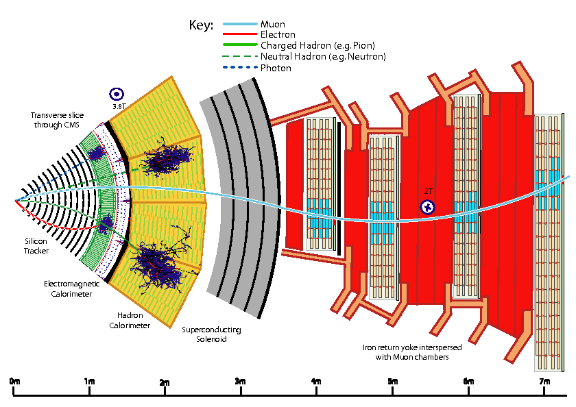

# Home
Welcome to the documentation of the CMS Particle Flow Algorithm.   
The aim of this page is to provide a centralized overview of the CMS Particle Flow algorithm with the main focus being on:

* [Core Particle Flow algorithm](page2.md)
* [Particle Flow Block algorithm](pfblock.md)

## What is Particle Flow?

The Particle Flow (PF) algorithm is used to reconstruct and identify individually all particles produced in CMS by combining information from all subdetectors. 
These particles include: 

* [Muons](page2.md#muons)
* [Electrons](page2.md#electrons)
* [Photons](page2.md#photons)
* [Charged hadrons](page2.md#charged-hadrons)
* [Neutral hadrons](page2.md#neutral-hadrons)

## How do particles traverse through the CMS detector?

Starting from the beam interaction region, particles will enter:

* Inner tracker
* Electromagnetic calorimeter (ECAL)
* Hadronic calorimeter (HCAL)
* Muon chambers

The CMS detector has a large superconducting solenoid magnet as its central feature. The tracker system and both calorimeters are immersed in the magnetic field of the solenoid, which bends the trajectory of charged particles allowing to precisely measure their momentum and identify their charge. A transverse slice of the CMS detector can be seen in figure 1, showing how different particles interact with the detector elements and travel through the detector. A detailed description of the CMS detector with all of its subdetectors can be found in . A short summary of the particle interactions in the detector elements is given below. 

  {align="center"}
  <figcaption>Schematic of the specific particle interactions in a transverse slice of the CMS detector</figcaption>

1. After the collisions, particles first enter the inner tracking system, where charged particle trajectories (tracks) and origins (vertices) are reconstructed from hits in the sensitive layers of the CMS tracking system. The tracks are bent due to the magnetic field, which enables the measurement of charged particle momentum and electric charge.
2. After the tracker, particles enter the ECAL, where electrons and photons are fully absorbed. Coming into contact with the ECAL material, electromagnetic particles start showering and are detected as clusters of energy. 